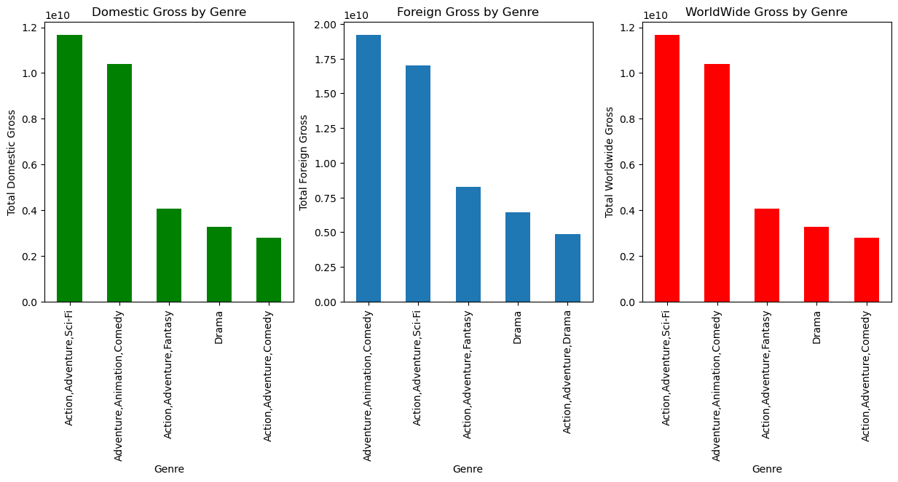
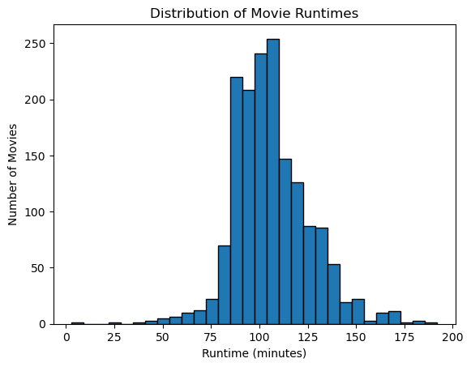
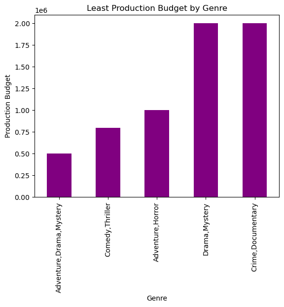
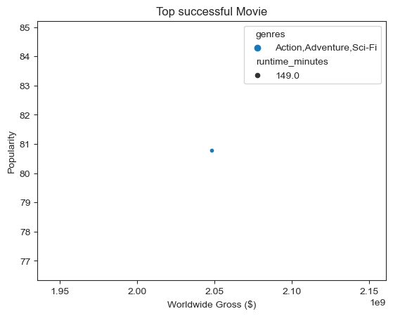

# dsc-phase-1-project

  

# Overview

Microsoft sees all the big companies creating original video content and they want to get in on the fun. They have decided to create a new movie studio, but they don’t know anything about creating movies. You are charged with exploring what types of films are currently doing the best at the box office. You must then translate those findings into actionable insights that the head of Microsoft's new movie studio can use to help decide what type of films to create.

# Business Understanding

Microsoft is seeking to create a new movie studio and wants to understand what types of films are currently popular at the box office. They are looking to use data science to analyze market trends and gain insights into what factors contribute to a film's success. By understanding what types of films are resonating with audiences, Microsoft can make informed decisions on what types of films to produce and market. This will allow them to increase their chances of success in the competitive film industry.

The business problem is that Microsoft wants to create a new movie studio but doesn't have any knowledge or experience in the movie industry. They need to determine what types of films are currently successful at the box office in order to make informed decisions about what types of films to produce. By understanding the current trends and patterns in the film industry, Microsoft can increase the chances of producing successful and profitable films.
# Data Understanding and Analysis

The movie dataset that i will be working with are from:
[Box Office Mojo] (https://www.boxofficemojo.com/),
[IMDB] (https://www.imdb.com/), 
[TheMovieDB] (https://www.themoviedb.org/),
[The Numbers] (https://www.the-numbers.com/)

The data sources are popular online based websites that most people use to refer to when looking up what movies to watch.

These datasets contain data about the movies that have aired over the years , the trend of popularity , the overall gross and genres, etc.
These datasets will help in determining what sort of movie for the studio to invest in.

# DATA ANALYSIS
First analysis  
I grouped the data by genres and calculate the total domestic gross, foreign gross and world wide gross to find out the genres that brings in alot of profit.  

  
Action,Adventure,Sci-Fi have the top total domestic gross and worldwide gross.
Adventure, Animation, and Comedy genre have the top total foreign gross.  

                 
Second analysis  
I created a histogram of movie runtimes using the hist() method and set the number of bins to 30, which will create 30 evenly-spaced bins for the range of values in the runtime minutes column.
The histogram of movie runtimes shows the frequency distribution of movies across different runtime intervals. 
This plot can help you identify if there are any common runtime intervals for successful movies, or if there is a trend toward shorter or longer movies. 

  
Acoording the histogram above the popular trend of runtime minutes is between 100 and 110 minutes.  

Third analysis  
I found the movie genres that costs least to produce by grouping data by genres and calculate total production budget to find the least production cost.  

  

The genres with least production cost are Adventure,Drama,Mystery.     

Fourth analysis  
I analysed the data and found the most successfull movie of all time(Avengers: Infinity War) and further analysed its characteristics.    

  
According the above visualization the genres of the most successful movie is Action, Adventure and Sci-fi and the runtime minutes is 149.  

# CONCLUSION  

In conclusion from the analysis genres is the main factor that should be considered when deciding what type of movIe to produce.  
FINDINGS       
From above the analysis the ideal genres to invest in depend on the target audience as I have elaborated by the visualization above.  

The genres I highly recommend Microsoft to invest in are Action,Adventure,Sci-Fi since they have the top total domestic gross and worldwide gross.    

If the target audience of the movie to be created is the international market excluding the domestic market, Microsoft should invest in Adventure, Animation, and Comedy genre since it brings in the highest Foreign gross profit.             

In consideration of the production cost, the genres with the least production cost are Adventure,Drama,Mystery.    
Microsoft should conider this option if the main goal is to produce a movie with the least cost incurred but this will not quarantee the success of the movie.      

The ideal runtime according to the popular trend foLlowed by most movies in  production is between 100 and 110 minutes.This couls be a good start for the production of the first Microsoft movie.      

Microsoft can also consider adapting the trend of the most popular movie of all time which have a runtime of 149 minutes and genres of Action, Adventure, and Sci-Fi. This will ensure the popularity of the movie.  